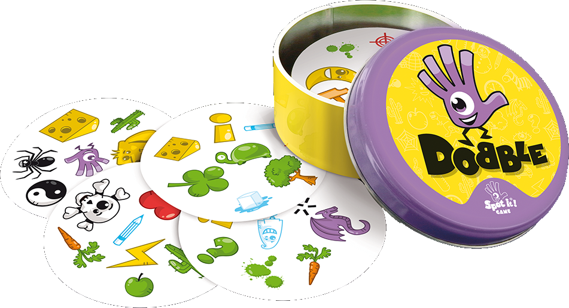

#                                                   	Super Dobble

> **Le but de ce projet est de modéliser Dobble sous la forme d'un problème SAT pour déterminer s'il est possible d'y jouer avec plus de cartes, tout en respectant le principe du jeu.**

**Dobble** est un jeu de société comprenant 55 cartes, avec 8 symboles par carte pour un total de 57 symboles différents. La particularité que deux cartes du jeu possède toujours exactement un symbole en commun.

Le but du jeu est à chaque fois de trouver le symbole commun entre 2 cartes. Il s'agit donc d'un jeu de rapidité et de réactivité.

<u>exemple de 3 cartes et de leur symboles identiques associés</u>

Les caractéristiques de ce jeu font qu'on peut le modéliser sous la forme d'un **problème sous contraintes**. On choisit de le modéliser sous la forme d'un problème **SAT** (sous la fore de variables booléennes).

Le jeu se modélise de la façon suivante : 

- Le jeu possède exactement 55 cartes

- Sur chaque carte on trouve exactement 8 symboles

- Il existe 57 symboles différents dans le jeu

- Deux cartes du jeu ont toujours exactement un symbole en commun

  

